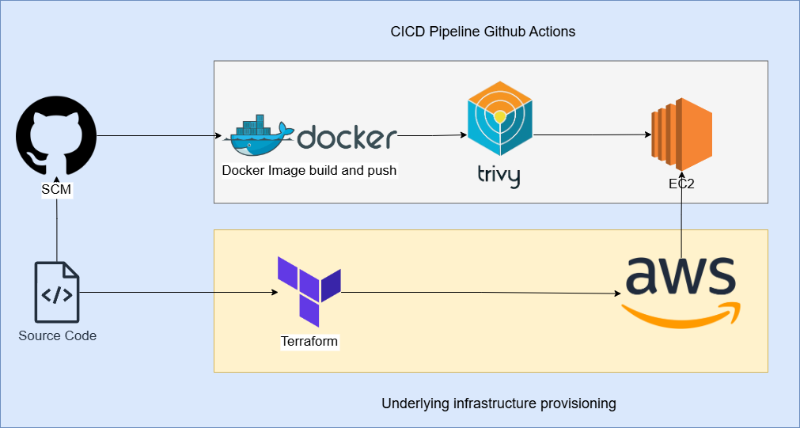

# Multi-Cloud CI/CD Pipeline with Terraform and GitHub Actions (AWS Only)

## Project Overview

This project demonstrates a fully automated Continuous Integration and Continuous Deployment (CI/CD) pipeline using **GitHub Actions**, **Terraform**, and **Docker**, deploying a Node.js application to an **AWS EC2** instance. Security is embedded via **Trivy vulnerability scanning**. This is part of a broader hybrid/multi-cloud infrastructure portfolio, though this version targets AWS only.

---

## Tech Stack

| Layer            | Tools Used                                 |
| ---------------- | ------------------------------------------ |
| CI/CD            | GitHub Actions                             |
| Infrastructure   | Terraform                                  |
| Compute          | AWS EC2 (Amazon Linux 2)                   |
| Containerization | Docker                                     |
| Security         | Trivy (AquaSec) for vulnerability scanning |
| Source Control   | GitHub                                     |

---

## 📁 Project Structure

```
multi-cloud-ci-cd-pipeline/
├── app/                   # Node.js app with Dockerfile
├── terraform/             # Terraform files for AWS EC2 provisioning
│   ├── main.tf
│   └── variables.tf
├── security/
│   └── trivy-scan.sh      # Docker image scan script
├── .github/
│   └── workflows/
│       └── deploy.yml     # GitHub Actions workflow
├── docs/
│   └── architecture-diagram.png
├── .gitignore
└── README.md
```

---

## 🚀 CI/CD Pipeline Workflow

1. **Trigger**: Push to `main` branch.
2. **Build**: Docker image built from Node.js app in `/app`.
3. **Scan**: Trivy scans Docker image for vulnerabilities (HIGH/CRITICAL).
4. **Transfer**: Docker image is `scp`'d to EC2.
5. **Deploy**: SSH into EC2, load image, stop old container, run new one.
6. **Check**: Optional health check using `curl`.

---

## 🔐 GitHub Secrets Used

| Name          | Description                      |
| ------------- | -------------------------------- |
| `EC2_HOST`    | Public IP or DNS of EC2 instance |
| `EC2_USER`    | SSH username (e.g. `ec2-user`)   |
| `EC2_SSH_KEY` | Base64-encoded PEM private key   |
| `DOCKERHUB_USERNAME`    | Docker username (e.g. `xyz`)   |
| `DOCKERHUB_PASSWORD` | Docker token for repo   |

---

## 🛡️ Security Scan with Trivy

**Trivy** scans the Docker image before deployment:

* Scans for **HIGH** and **CRITICAL** vulnerabilities
* Fails build if any are found (optional)
* Easy to extend with report uploads or SBOMs

---

## 🧪 Health Checks

* The pipeline optionally verifies the app is running by hitting the exposed port via `curl`.
* Example: `curl http://<EC2_PUBLIC_IP>`

---

## ✅ Success Metrics

| Criteria                 | Status           |
| ------------------------ | ---------------- |
| Docker Image Build       | ✅ Successful     |
| Trivy Vulnerability Scan | ✅ Passed         |
| EC2 Deployment via SSH   | ✅ Working        |
| Live App Health Check    | ✅ Responsive     |
| Fully Automated Pipeline | ✅ No Manual Step |
| Recovery Time (MTTR)     | < 5 minutes      |

---

## 📌 How to Reuse

1. Clone the repo
2. Update your `terraform/variables.tf` or pass in variables for:

   * `key_name`: name of existing AWS key pair
3. Add your private key to GitHub Secrets as base64 (`EC2_SSH_KEY`)
4. Push changes to `main` to auto-deploy

---

## 📷 Architecture Diagram



---

## 📚 Future Extensions

* Add Azure and on-prem Kubernetes support
* Integrate GitHub Container Registry or ECR
* Add auto-destroy and redeploy logic
* Multi-stage Docker builds for optimized image size
* Notifications (Slack, Email) on pipeline failure

---

## 👨‍💻 Author

**Syed Farjad**
DevOps & Cloud Engineer with Industrial IoT & Manufacturing Optimization focus
[LinkedIn Profile](https://www.linkedin.com/in/muhammadfarjad2/)

---

## 📝 License

MIT License. See `LICENSE` file.

---
